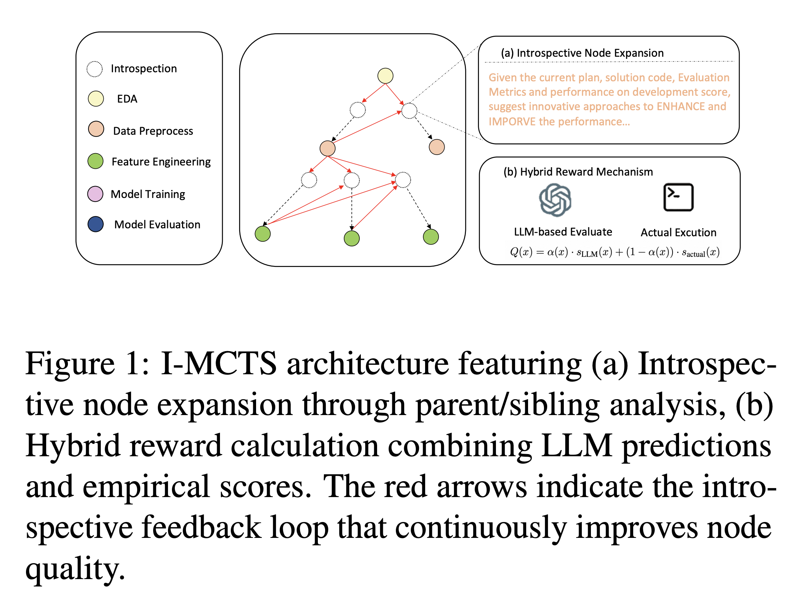

# I-MCTS: Enhancing Agentic AutoML via Introspective Monte Carlo Tree Search

This is the implementation of our paper: [I-MCTS: Enhancing Agentic AutoML via Introspective Monte Carlo Tree Search](https://arxiv.org/abs/2502.14693)

## Introduction

Recent advancements in large language models (LLMs) have shown remarkable potential in automating machine learning tasks. However, existing LLM-based agents often struggle with low-diversity and suboptimal code generation. In this study, we introduce Introspective Monte Carlo Tree Search (I-MCTS), a novel approach that iteratively expands tree nodes through an introspective process that meticulously analyzes solutions and results from parent and sibling nodes. This facilitates a continuous refinement of the node in the search tree, thereby enhancing the overall decision-making process. 
Furthermore, we integrate a Large Language Model (LLM)-based value model to facilitate direct evaluation of each node's solution prior to conducting comprehensive computational rollouts. A hybrid rewarding mechanism is implemented to seamlessly transition the Q-value from LLM-estimated scores to actual performance scores. This allows higher-quality nodes to be traversed earlier. Applied to the various ML tasks, our approach demonstrates a 6% absolute improvement in performance compared to the strong open-source AutoML agents, showcasing its effectiveness in enhancing agentic AutoML systems. 

## Key Features
- Introspective Node Expansion process from parent and sibling nodes
- Hybrid Rewarding Mechanism that allows higher-quality nodes to be traversed earlier.
<div align="center">
  
  <br>
  <em>The framework of I-MCTS for Agentic AutoML systems.</em>
</div>


## Get Start

To run the experiments we did in the paper, please follow the instruction in the following document:


### Data Preparation

You can download the datasets from the link.
- **Download Datasets:** [Dataset Link](https://drive.google.com/drive/folders/151FIZoLygkRfeJgSI9fNMiLsixh1mK0r?usp=sharing)

### Configurations

- **`datasets.yaml`:** Provide base prompts, metrics, and target columns for respective datasets.
- **`data.yaml`:** Modify `datasets_dir` to the base directory of all prepared datasets.

`LLM Config`:

```yaml
llm:
  api_type: "dashscope"  # or azure / ollama / groq etc.
  model: "qwen2.5-72b-instruct"  # or gpt-3.5-turbo
  base_url: "https://dashscope.aliyuncs.com/compatible-mode/v1"  # or forward url / other llm url
  api_key: "key"
```


### Runing Experiments

    ```bash
    sh metagpt/ext/sela/scripts/run_cls.sh
    sh metagpt/ext/sela/scripts/run_reg.sh
    ```

## Citation 

If you use this code in your research, please cite our work:

```bibtex
@article{liang2025mcts,
  title={I-MCTS: Enhancing Agentic AutoML via Introspective Monte Carlo Tree Search},
  author={Liang, Zujie and Wei, Feng and Xu, Wujiang and Chen, Lin and Qian, Yuxi and Wu, Xinhui},
  journal={arXiv preprint arXiv:2502.14693},
  year={2025}
}
```

## Acknowledge
- This work is based on [SELA](https://github.com/geekan/MetaGPT/tree/main/metagpt/ext/sela) and [MetaGPT](https://github.com/geekan/MetaGPT) framework, many thanks for their effort.
